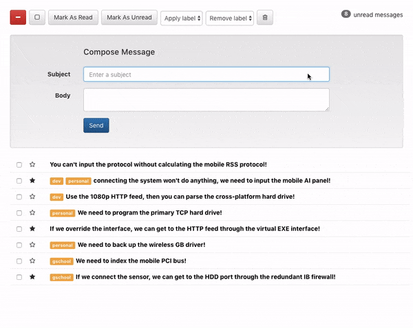

# React Inbox

The React Inbox uses a modern layout with a user friendly interface. 

## How it works 
The website acts like a common email application. The user can compose a messages. 

The user can delete messages. 

Delete gif 

Adding labels and starring messages makes it easier to organize. 

Labels/Starring gif 

The user has the ability to grab messages in bulk. The icon will change accordingly and even changes when there are only some messages selected. 

Bulk/Select/Deselect/Some gif 

Finally, the user can change whether or not a messages has been read or unread. This will be reflected in the unread messages count in the upper right corner. 

Read/Unread gif 