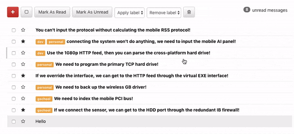
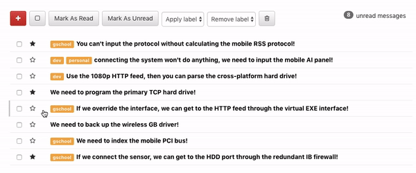
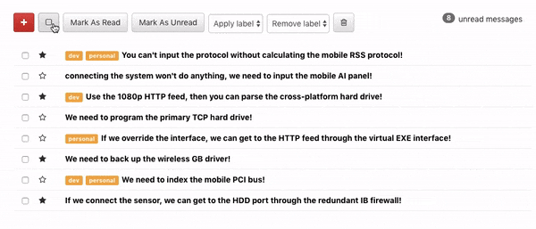
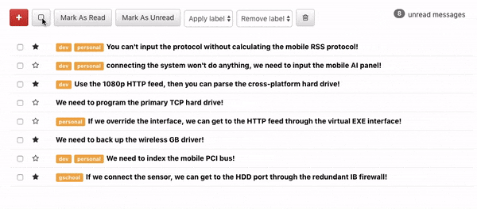

# React Inbox

The React Inbox uses a modern layout with a user friendly interface. 

## How it works 
- The website acts like a common email application. The user can compose a message. 

- The user can delete messages. 

- Adding labels and starring messages makes it easier to organize. 

 

- The user has the ability to grab messages in bulk. The icon will change accordingly and even changes when there are only some messages selected. 

- Finally, the user can change whether or not a messages has been read or unread. This will be reflected in the unread messages count in the upper right corner. 

### Technologies 

React.js, CSS, Postman, Bootstrap, Flexbox, and JavaScript

## Author

* **Bethany Mitch** - *BM* - [justcallmebeef](https://github.com/justcallmebeef)